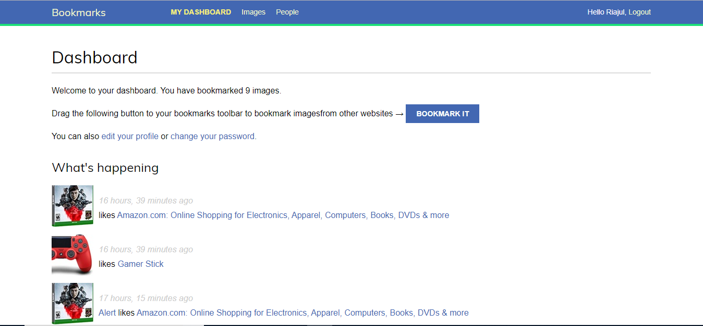

# image-bookmark

### To Run Project 
``` 
    git clone https://github.com/RiajulKashem/image-bookmark.git
    cd image-bookmark
    virtualenv env
    sourch env\bin\active
    pip install -r requirements.txt
    python manage.py runserver
```
**if you like this project dont't forget to give a star**
### If Bookmarking Button Doesn't Work 

* Change images > static > bookmarklet.js > site_url = into your domain

* Change images > templates > bookmarklet_laucher.js > src = your domain

### Screenshot


